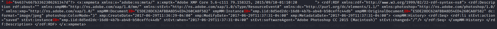
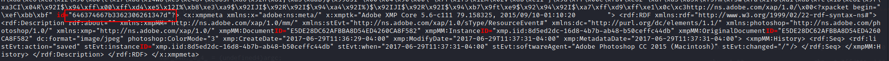

# Show Us Your ID

## Solutions

```
strings nyan.pdf | grep -i "id="
```

```
...id="646374667b3362306261347d"?>...
```
```
pdf-parser -c nyan.pdf | grep -i "id="
```

```
 ...id="646374667b3362306261347d"?>...
 
 What is left is hex decoding
```
